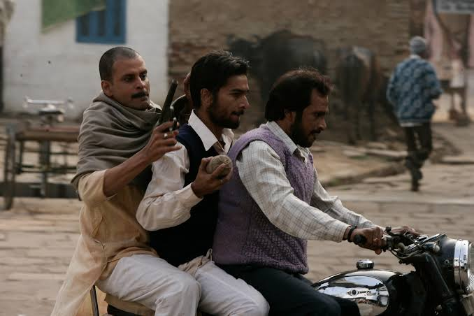

# heading 1 
## heading 2
### heading 3
#### heading 4
##### heading 5
###### heading 6

---

## About Bold and Horizontel Line

this is horizontel line

---


**this is bold text**


*this is itallic text*


>this is a blockquote


This is Ordered List.
---
1. This is a list 1
2. This is a list 2

This is Unordered List.
---
- this is another list
- this is another list


One Line & Multiline Code
---
`#include<stdio.h>`


```javascript
//this is javascript code

console.log("Hello World");

function hello(){
    console.log("Hello World");
}

hello();

```

This is link text.
---

[twitter](https://twitter.com/)


Importing an Image.
---



Extended Syntax
---

- [x] This is a task
- [ ] This is a task

:joy:

Subscript and Superscript
---

H<sub>2</sub>O

X<sup>2


Table
---

| Syntax | Description |
| ---    |  ---        |
| header | title      |


Highlight
---
I need to highlight these `very important words`.


Strikethrough
---
~~The world is flat.~~